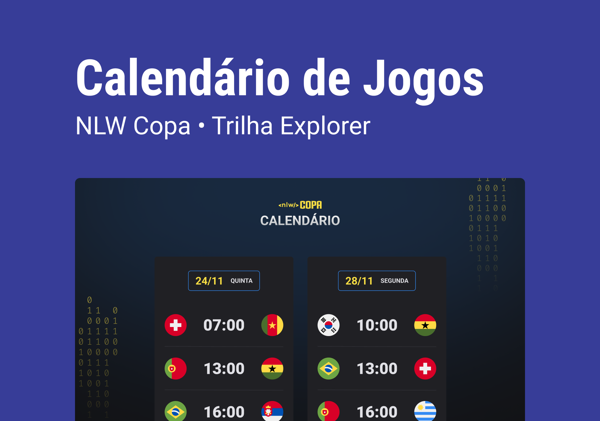

<h1 align="center"> World Cup 2022 Schedule </h1>

Exclusive and free event, promoted by Rocketseat for teaching WEB technologies.

  <a href="#-technologies">Technologies</a>&nbsp;&nbsp;&nbsp;|&nbsp;&nbsp;&nbsp;
  <a href="#-project">Project</a>&nbsp;&nbsp;&nbsp;|&nbsp;&nbsp;&nbsp;
  <a href="#-layout">Layout</a>&nbsp;&nbsp;&nbsp;|&nbsp;&nbsp;&nbsp;
  <a href="#memo-license">License</a>

  

 

  

## 🚀 Technologies

This project was developed with the following technologies:

- HTML e CSS
- JavaScript
- Git & GitHub

## 💻 Project

The Cup Calendar is a project that shows the 2022 World Cup Matches.

## 🔖 Layout

You can view the layout of the project through [THIS LINK](https://www.figma.com/file/n1yHAjUjSAEXHRpeK6CZbv/Calend%C3%A1rio-de-Jogos-(Community)?node-id=301%3A1812/duplicate). You need an account on [Figma](https://figma.com) to access it.

## :memo: License

This project is under the MIT license.

---

Made with ♥ by Danildo Silva :wave: [Connect with me!](https://www.linkedin.com/in/danildosilva/)
